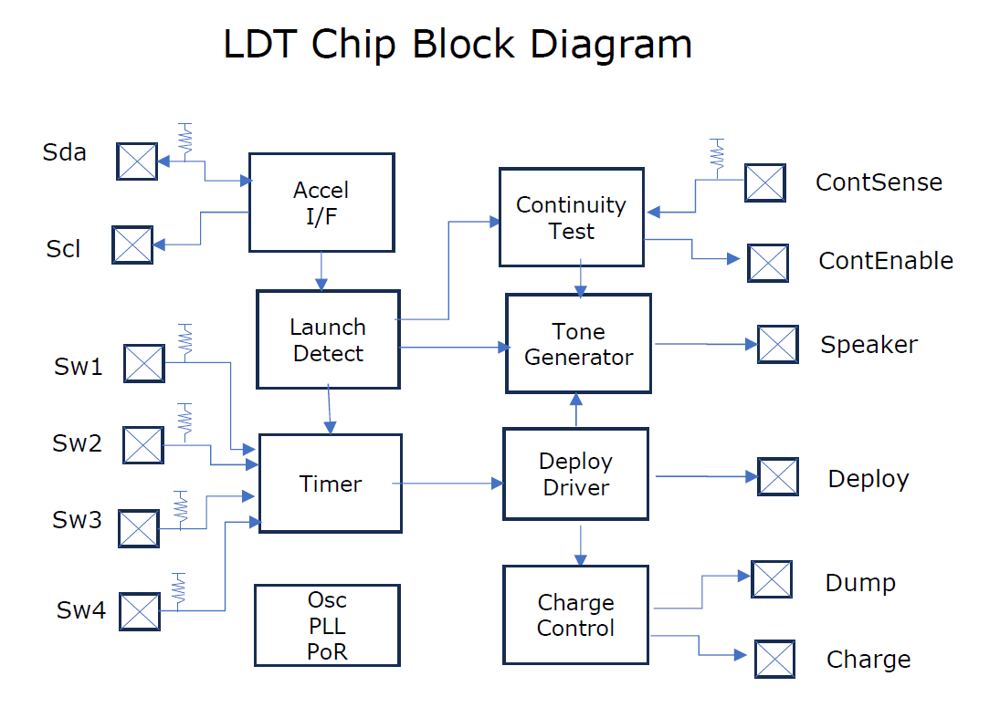
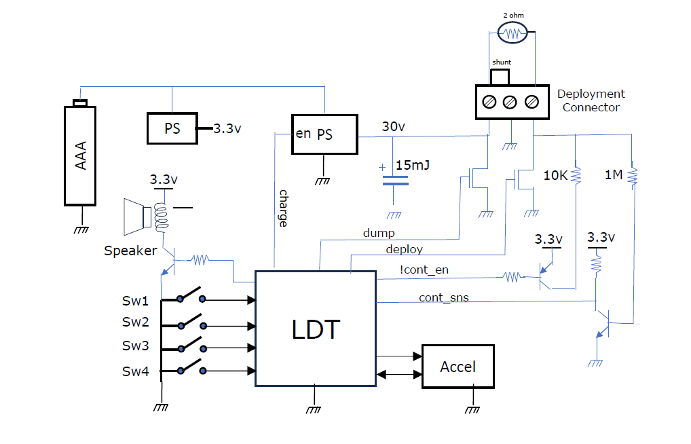
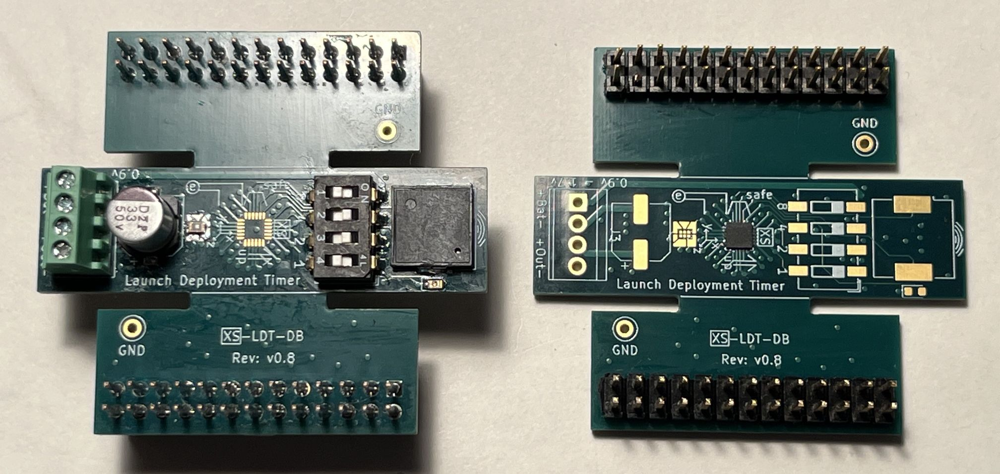

<!---

This file is used to generate your project datasheet. Please fill in the information below and delete any unused
sections.

You can also include images in this folder and reference them in the markdown. Each image must be less than
512 kb in size, and the combined size of all images must be less than 1 MB.
-->

## How it works

This TinyTapeout design implements a complete launch‑detect deployment timer (LDT) for model rocket recovery. It polls an external I²C accelerometer, then waits to for a launch accelleration (sustained >2 g), it executes a fixed sequence: a programmable delay, a pre‑charge window, a one‑tick deployment pulse, and follows with a post‑deployment warble tone on a piezo output. Prior to launch continuity checking is done at 1Hz with the piezo giving single beep when ok, and double beep if continuity test failed. Once the launch sequence begins all further inputs are ignored, making the device a single‑shot, deterministic controller that fits comfortably within a 1×1 TinyTapeout tile.

This chip starts with a [datasheet](XS-LDT-01_Datasheet.pdf) where the chip I/O is nailed down and expanded. 

The I/O is expanded internally into a chip block diagram.

And the I/O is expanded out into the system diagram so the chip context is clear.

Photo of dev board. Left board populated except LDT chip, right with LDT chip (SLG47910V with TT logic). The emulation header breaks out all the chip I/O and allows two boards for testing.

## How to test

A development board was designed, built, and tested. Along with a Max10 I/o Monitoring fpga, the TT pmods can be connected directly
to emulation headers on the development board. Also before endangering the hardware a Max10 chip tester (using the sys model 
used in verificaiton) can be used to test and observe safe reset and operation.

## Verification Summary

This design was validated through a full end‑to‑end pipeline: accelerated RTL simulation (Icarus/Verilator) and gate‑level reset/X‑prop checks; MAX10 FPGA prototyping with real accelerometer and FRAM hardware-in-loop; a flight test with recovered logs that exposed and resolved a periodic write bug; Forge silicon bring‑up using the MAX10 full‑chip emulator and an independent monitor for signal observation; iterative board revisions driven by real hardware behavior; and final OTP, PCB‑level, and system‑level tests confirming correct sequencing, safety behavior, and deployment timing. The commit history captures each stage of this progression, demonstrating repeated, real‑world validation before tapeout

## External hardware

Primary hardware: MXC400 accelerometer by I2C bus, a piezo, Dip_sw4. Two connections to a continuity test circuit and 4 deployment connections.

